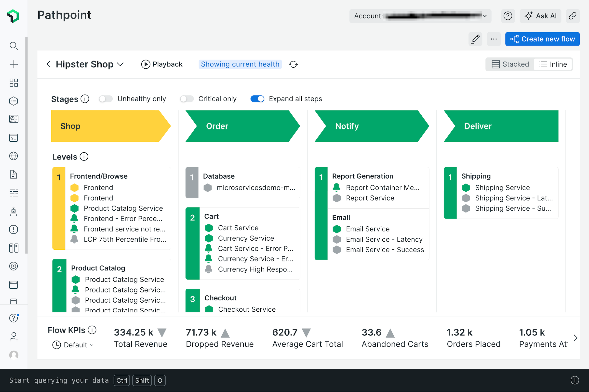

<a href="https://opensource.newrelic.com/oss-category/#community-plus"><picture><source media="(prefers-color-scheme: dark)" srcset="https://github.com/newrelic/opensource-website/raw/main/src/images/categories/dark/Community_Plus.png"><source media="(prefers-color-scheme: light)" srcset="https://github.com/newrelic/opensource-website/raw/main/src/images/categories/Community_Plus.png"></picture></a>

# Pathpoint v2 (v2.5)

Pathpoint is a New Relic Open Source app used to model business processes end-to-end. It provides an ideal venue to marry the operational state of an entire process with the key business metrics that evaluate the success of that process - using Pathpoint, your dev and operational teams can draw a straight line from the performance health of the process to the business objectives it services.

## Usage

See [Enabling this App](#enable) for instructions on how to get Pathpoint turned on in your account(s).

Refer to the [Usage Guide](docs/guides/usage/index.md) for full details on using Pathpoint.

And finally, [this article in the New Relic docs website](https://docs.newrelic.com/docs/new-relic-solutions/business-observability/intro-pathpoint/) provides additional information about using Pathpoint and best practice for modeling your business journeys in Pathpoint.

</a>

## Dependencies

Requires no specific data or additional features.

## Enabling this App

This App is available via the New Relic Catalog.

To enable it in your account:

1. go to `Integrations & Agents > Apps and Visualzations` and search for "Pathpoint v2"
2. Click the `Pathpoint v2` card, and then click the `Add this App` button to add it to your account(s)
3. Click `Open App` to launch the app (note: on the first time accessing the app, you may be prompted to enable it)

Once you have added your accounts, you can also open the app by:

1. Open the `Apps` left-hand navigation menu item (you may need to click on the `Add More` ellipsis if it doesn't show up by default)
2. In the `Your Apps` section, locate and click on the `Pathpoint v2` card to open the app

#### Manual Deployment

If you need to customize the app, fork the codebase and follow the instructions on how to [Customize a Nerdpack](https://docs.newrelic.com/docs/new-relic-solutions/tutorials/customize-nerdpacks/). If you have a change you feel everyone can benefit from, please submit a PR!

## Support

Should you need assistance with Pathpoint, please leverage one of the following channels:

If you have a question about how to use the app, please review the comprehensive [usage documentation](docs/guides/usage/index.md). If you are still unsure, feel free to open a question for us in the [Discussions forum](../../discussions).

If you have identified a bug, or if you have a feature request, please file a [Github issue](../../issues).

You can also reach out to [New Relic Technical Support](https://support.newrelic.com/) 24/7/365 ticketed support. Read more about our [Technical Support Offerings](https://docs.newrelic.com/docs/licenses/license-information/general-usage-licenses/support-plan). 

We also encourage you to bring your experiences and questions to the [Explorers Hub](https://discuss.newrelic.com) where our community members collaborate on solutions and new ideas.

## Security

As noted in our [security policy](https://github.com/newrelic/nr-labs-pathpoint/security/policy), New Relic is committed to the privacy and security of our customers and their data. We believe that providing coordinated disclosure by security researchers and engaging with the security community are important means to achieve our security goals.

If you believe you have found a security vulnerability in this project or any of New Relic's products or websites, we welcome and greatly appreciate [you reporting](https://docs.newrelic.com/docs/security/security-privacy/information-security/report-security-vulnerabilities/) it to New Relic.

## Contributing

Contributions are welcome (and if you submit a Enhancement Request, expect to be invited to contribute it yourself :grin:). Please review our [Contributors Guide](CONTRIBUTING.md).

Keep in mind that when you submit your pull request, you'll need to sign the CLA via the click-through using CLA-Assistant. If you'd like to execute our corporate CLA, or if you have any questions, please drop us an email at opensource@newrelic.com.

## Open Source License

This project is distributed under the [Apache 2 license](LICENSE).
